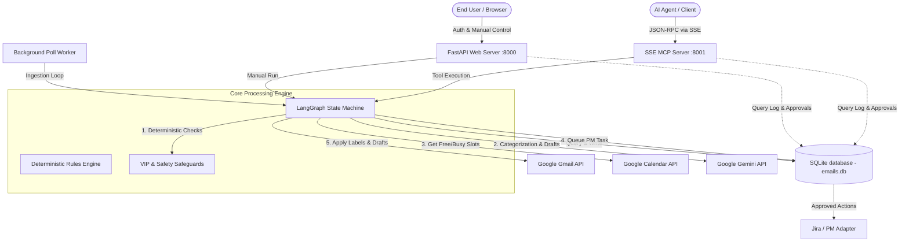

# System Architecture Specification

This document details the core architectural components, execution flow, data flow, and design patterns utilized in the Email Organizer project.

---

## 🏗️ Architectural Overview

The system consists of three main interfaces working over a shared database and configuration layout:
1. **FastAPI Web Application**: Serves the REST API and coordinates OAuth authorization callbacks.
2. **Background Poll Worker**: Executes periodic fetches from Gmail and streams emails through the LangGraph pipeline.
3. **SSE MCP Server**: Implements the Model Context Protocol directly using SSE transport to allow AI agents to manage email states.

### Component Relationship Diagram



---

## 📈 Triage Pipeline Execution Flow

The core triage sequence is built as a compiled **LangGraph** `StateGraph`. Each step is isolated as a node that updates a shared `EmailState` dict.

```text
[Incoming Email Message]
          │
          ▼
┌──────────────────┐
│  0. Pre-Check    │ ──► Normalizes subject & body encoding. Checks VIP/No-Reply patterns.
└─────────┬────────┘
          ▼
┌──────────────────┐
│  1. Classification│ ──► Structured LLM query returns category, tags, and reply necessity.
└─────────┬────────┘
          ▼
┌──────────────────┐
│  2. Action Plan  │ ──► Evaluates category rules + applies VIP safeguards.
└─────────┬────────┘
          │
          ├─────── Category == "Calendar/Scheduling"?
          │       ├── YES ──► [3. Calendar Context] (Appends free/busy slots)
          │       └── NO  ──► [Skip]
          ▼
┌──────────────────┐
│  4. Execute      │ ──► Mutates Gmail (Drafts/Labels) in LIVE or logs in DRY_RUN mode.
└─────────┬────────┘
          ▼
┌──────────────────┐
│  5. Log Result   │ ──► Persists execution logs and PM task queues in SQLite.
└──────────────────┘
```

### LangGraph Pipeline Nodes Detail

1. **`pre_check_email`** (`app/pipeline/nodes.py`)
   - Cleans up character encodings.
   - Deterministically matches the sender against configured VIP domains, email lists, and no-reply patterns in `config/vip_rules.yaml`.
   
2. **`classify_email`** (`app/pipeline/nodes.py`)
   - Queries a Gemini model (configured in `config/models.yaml`) using a Pydantic schema constraints constraint (`EmailClassification`).
   - Retrieves category, urgency (1–10), confidence score (1–100), reasoning, suggested reply draft, and contextual tags.
   - **Safety Override**: If LLM confidence is less than 85%, the category is automatically overridden to `Needs Review` to avoid false actions.
   
3. **`plan_gmail_actions`** (`app/pipeline/nodes.py`)
   - Queries the YAML-defined rules engine (`config/rules/defaults.yaml` and `config/rules/overrides.yaml`) to map the category to concrete steps (e.g. `apply_label`, `create_draft_reply`).
   - Enforces VIP safety overrides: ensures the `@VIP` label is set and prevents any archiving actions from running.
   
4. **`handle_calendar`** (`app/pipeline/nodes.py`)
   - Connects to Google Calendar API to fetch free/busy slots and upcoming events. 
   - Appends a summary of availability to the state so drafts can state when the user is free.
   
5. **`execute_actions`** (`app/pipeline/nodes.py`)
   - In **Dry Run Mode**: Logs all actions to `audit_log.csv` without calling mutation APIs.
   - In **Live Mode**: Issues Google API mutations. For drafts, it appends availability (if any) and applies a date-based tracking label (e.g. `Drafts/2026-08-27`). If a project management task is identified, it writes a pending task to the local queue.
   
6. **`log_result`** (`app/pipeline/nodes.py`)
   - Saves final status, tags, actions, confidence, and timestamps to the local database.

---

## 🗄️ Database Schema

The database uses SQLite via SQLAlchemy. The models (`app/models.py`) include:

* **`User`**: Stores authenticated email address and OAuth credentials JSON (tokens).
* **`Email`**: Stores downloaded email metadata, subject, snippet, body, and dates.
* **`EmailTag`**: Stores LLM-generated analysis (canonical category, urgency score, confidence, tag lists, suggested reply).
* **`EmailProcessingLog`**: An audit table logging each pipeline execution (actions taken, dry-run status, pipeline versions, timestamp).
* **`PMActionQueue`**: Stores project management tasks that were extracted from emails. Tracks status (`pending`, `approved`, `executed`, `rejected`) and records the execution response.

---

## 🔌 SSE Model Context Protocol Server

The MCP Server (`mcp_server/server.py`) implements the official Model Context Protocol (MCP) using a standard Server-Sent Events (SSE) transport.

* **SSE Connection (`GET /sse`)**: Drops an SSE channel and registers a unique Session UUID.
* **Command Inbox (`POST /messages`)**: Receives JSON-RPC 2.0 requests from the client.
* **Tool Registry**: Registers Python methods as RPC tools:
  - `list_emails`: Queries processed emails.
  - `get_email`: Retrieves bodies and classifications.
  - `search_emails`: Generates a Gmail filter query via LLM and executes it on Gmail.
  - `run_pipeline`: Triggers the LangGraph engine for new emails.
  - `get_digest`: Gathers daily summaries.
  - `rescue_email`: Moves an incorrectly archived email back to the inbox.
  - `approve_pm_task`/`execute_pm_task`: Triggers the PM Adapter.
* **Resource Registry**: Exposes read-only views like `gmail://pipeline-status` and `gmail://recent-emails`.
